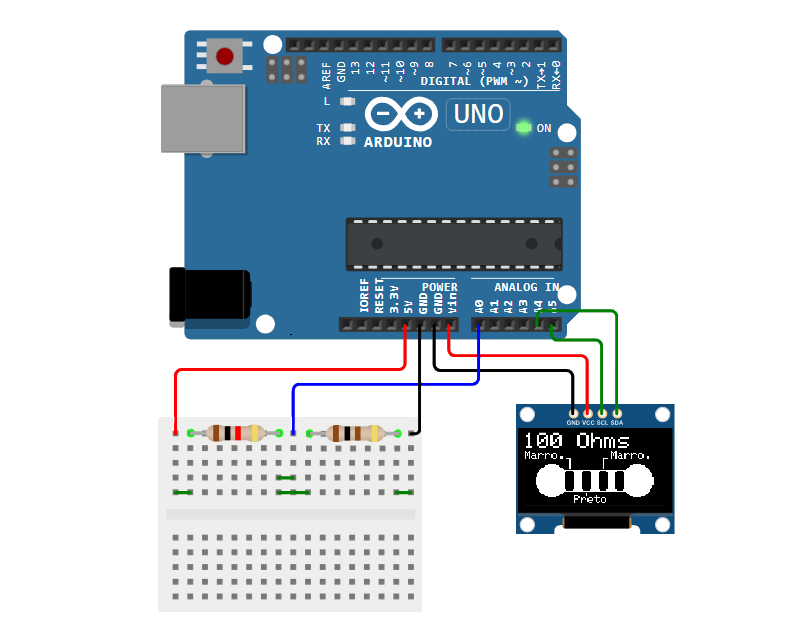

# Projeto: Resistômetro Digital com Display OLED

Este projeto de Laboratorio de Ciruitos consiste em um **resistômetro digital**, capaz de medir o valor de resistores comuns utilizando um Arduino e exibir o resultado em um display OLED 128x64. O circuito utiliza o princípio do divisor de tensão: um resistor conhecido (referência) é colocado em série com o resistor desconhecido, e a tensão no ponto comum é lida pelo Arduino para calcular o valor do resistor testado.

## Principais funcionalidades

- **Leitura automática do valor do resistor:** Basta conectar o resistor a ser testado no circuito, e o valor é exibido automaticamente.
- **Exibição clara:** O valor do resistor é mostrado em Ohms ou KOhms, de acordo com a faixa.
- **Reconhecimento das cores das faixas:** O display também mostra as cores correspondentes às faixas do resistor, facilitando o entendimento do código de cores.
- **Interface gráfica:** O display OLED exibe de forma visual o desenho do resistor e a indicação das faixas.

## Aplicações e Utilidade

- Prático para makers, estudantes e profissionais que precisam identificar rapidamente o valor de resistores.
- Pode ser adaptado para projetos com ESP32 ou STM32 com pequenas alterações.
- Útil como ferramenta didática para entender o funcionamento de divisores de tensão e leitura analógica em microcontroladores.

## Materiais necessários

- Arduino Uno (ou similar)
- Display OLED 128x64 (I2C)
- Resistor de referência (ex: 1kΩ)
- Jumpers e protoboard
- Resistor a ser testado

## Bibliotecas Necessárias 

Para o funcionamento correto deste projeto no Arduino, as seguintes bibliotecas devem estar instaladas:

- **Wire.h** : Biblioteca padrão para comunicação I2C (já inclusa na IDE do Arduino).
- **Adafruit_GFX.h** : Biblioteca gráfica da Adafruit para displays, responsável por desenhar formas, textos e gráficos no display OLED.
- **Adafruit_SSD1306.h** : Biblioteca específica para controle de displays OLED baseados no driver SSD1306 via I2C.

# Contrução do Circuito  

## Licença
Este projeto está licenciado sob a [MIT License](LICENSE).

## Contato
Para suporte ou dúvidas, entre em contato pelo email: volpatocursin@outlook.com 

